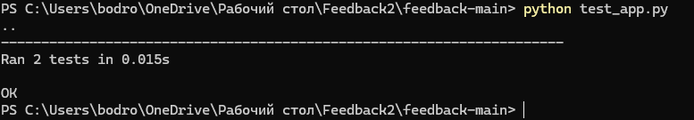

# Отчет по тестированию

## Результаты тестирования
Проведено автоматическое модульное тестирование (Unit Testing) функционала приложения.

### Сценарии:
1. `test_index_status`: Проверка доступности главной страницы (код 200).
2. `test_categories_presence`: Проверка корректности отображения категорий в форме.

### Результат:

*Статус: OK (все тесты пройдены успешно).*